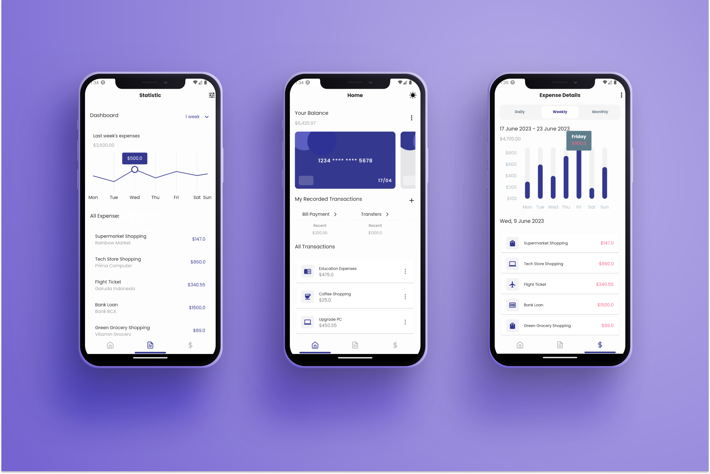
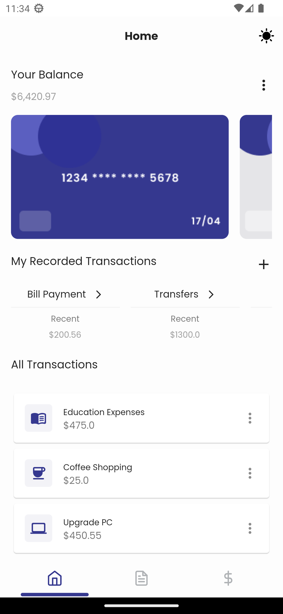
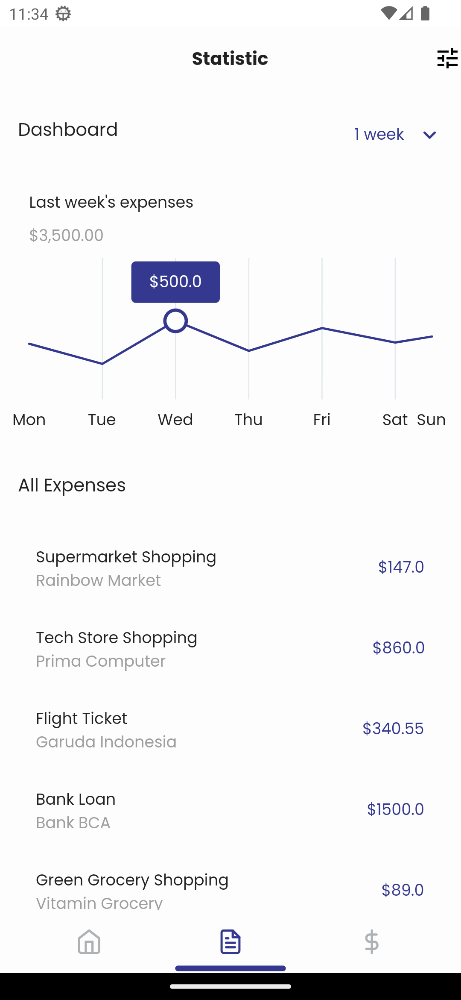
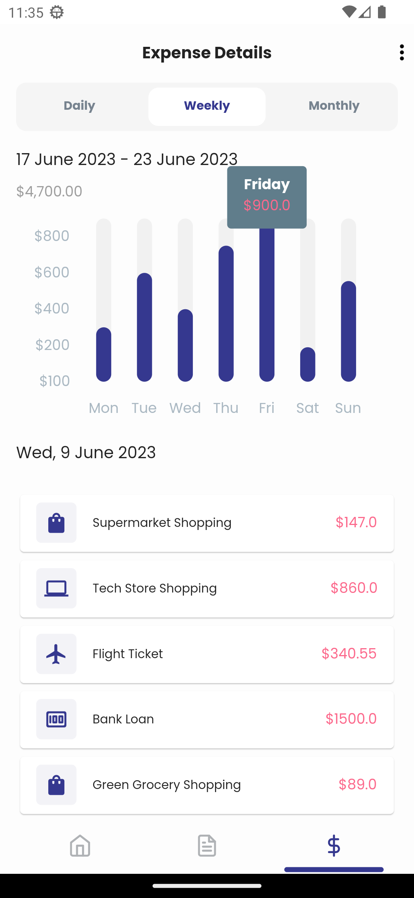
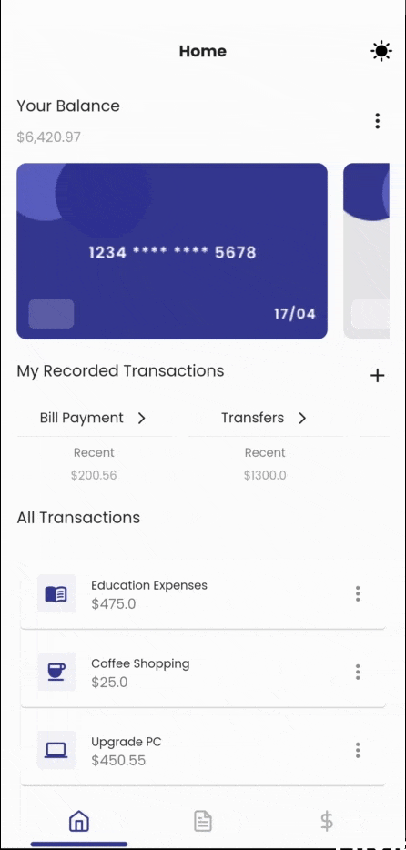

# Expense Manager (Flutter UI)

Welcome to my awesome Flutter project! 🚀 This project is designed to provide you with a **ready-to-use UI** built using Flutter, incorporating various essential features. Let's dive in!

🌟 If you find this project helpful or interesting, please consider starring it to show your support! 🌟

  

## Features

- **Ready-to-Use UI:** Get started quickly with a fully functional UI that you can build upon and customize according to your needs.

- **Riverpod State Management:** The project leverages Riverpod for efficient and predictable state management, making your app more maintainable and performant.

- **Localization:** Reach a global audience by easily integrating localization support, allowing your app to be presented in multiple languages.

- **Auto Route:** Navigation is a breeze with Auto Route, simplifying the process of defining and managing your app's navigation stack.

- **Flavor Configs:** Handle different environments (development, production, staging, etc.) effortlessly with flavor configurations, ensuring smooth deployment.

- **Animations:** Bring your app to life with captivating animations that enhance user experience and engagement.

## Screenshots

  
  
  

## App Preview

Check out this brief GIF preview of the app:

## Getting Started

For more information on how to run this code, go to [docs.md](docs.md)

## Contributions

Contributions are welcome! If you find any issues or want to add new features, feel free to fork the repository and submit pull requests.

## License

This project is licensed under the [MIT License](LICENSE).
